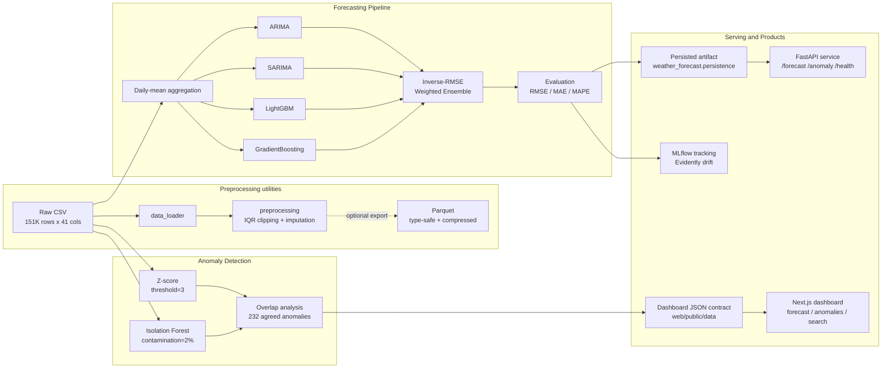

# weather-forecast — global daily-mean temperature forecasting and anomaly detection

> Forecasting a global daily-mean temperature signal built from 211 countries' data, using statistical and machine-learning ensemble methods, for agricultural, energy, and public-safety planning. The strongest single model reaches **0.27 °C RMSE** on a leakage-free 30-day holdout.

---

## What It Does

A data-science pipeline that forecasts a global daily-mean temperature series and flags anomalous weather events from raw global weather data.

- **Temperature forecasting** — a global daily-mean temperature series from a weighted ensemble of statistical and machine-learning models (built from 211 countries' data, not per-country forecasts)
- **Anomaly detection** — flags extreme weather with Z-score and Isolation Forest, plus overlap analysis between methods
- **Reproducible preprocessing** — cleans 151,000+ raw observations into type-safe, compressed Parquet
- **Environmental analysis** — an air-quality (PM2.5) study with SHAP feature-importance attribution, separate from the temperature forecaster
- **In-browser anomaly checking** — the dashboard scores a reading against an exported Isolation Forest entirely client-side, with no server call, matching the Python detector to 1e-6

## What It Is

`weather-forecast` is an **installable Python package** (`weather_forecast`) with a tested `src/` pipeline, a training CLI, a FastAPI serving service, MLflow/Evidently observability, and a Next.js dashboard, alongside a set of Jupyter notebooks that carry the analytical narrative and generate the dashboard's data contract. It turns raw weather CSVs into temperature forecasts and anomaly reports for teams whose planning depends on short-term weather: agriculture (frost/heat alerts, irrigation scheduling), energy (demand prediction, grid balancing), and public safety (extreme-weather warnings).

## Tech Stack

| Layer | Technology |
| --- | --- |
| Language | Python 3.10+ |
| Data processing | pandas, NumPy, PyArrow (Parquet) |
| Forecasting | LightGBM, scikit-learn (GradientBoosting), statsmodels (ARIMA/SARIMA), Prophet |
| Anomaly detection | scikit-learn (Isolation Forest), SciPy / NumPy (Z-score) |
| Serving | FastAPI, Uvicorn, Docker (multi-stage) |
| MLOps | MLflow (tracking), Evidently (drift) |
| Semantic search | sentence-transformers (`all-MiniLM-L6-v2`) |
| Dashboard | Next.js (static export), Astryx design system, D3, MapLibre |
| Packaging / CI | hatchling, pytest, ruff, mypy, GitHub Actions |

## Architecture



The whole pipeline lives in the installable `weather_forecast` package and runs from a training CLI (`python -m weather_forecast.train`). The notebooks are a parallel narrative: notebooks 02/04/07 call into the package, but the forecasting notebook (06) re-fits ARIMA, SARIMA, LightGBM, and GradientBoosting inline from the underlying libraries rather than calling `run_forecast`, and notebook 01 does not use the package at all. Reconciling the two is tracked in Project Status. Preprocessing can export a cleaned, compressed Parquet, but that is optional: the forecasting and anomaly-detection paths read the raw CSV directly (architecture decision EVO-1(b)). Forecasting fans out into four models that feed an inverse-RMSE weighted ensemble; anomaly detection runs two independent methods and reports their overlap. Trained artifacts are persisted, served over a FastAPI API, tracked with MLflow, monitored for drift with Evidently, and surfaced (with honest provenance) in a static Next.js dashboard.

## Engineering Decisions

The significant, hard-to-reverse decisions, each recorded as an ADR under
[`docs/adr/`](docs/adr/) (see [ADR 0001](docs/adr/0001-decision-records-flow.md) for the flow):

| Decision | ADR |
|----------|-----|
| IQR clipping for outliers (preserves temporal continuity) | [0005](docs/adr/0005-iqr-outlier-clipping.md) |
| Parquet for the processed store (type safety, compression) | [0006](docs/adr/0006-parquet-processed-store.md) |
| Column-candidates loader (handles dataset-version drift) | [0007](docs/adr/0007-column-candidates-loader.md) |
| PyArrow engine directly (avoids a Jupyter kernel crash) | [0008](docs/adr/0008-pyarrow-engine-direct.md) |
| Lag + rolling features (captures autoregressive structure) | [0009](docs/adr/0009-lag-rolling-features.md) |
| Inverse-RMSE weighted ensemble (risk diversification) | [0010](docs/adr/0010-inverse-rmse-ensemble.md) |
| Observatory identity, single-scroll IA, self-hosted fonts | [0002](docs/adr/0002-observatory-identity.md), [0003](docs/adr/0003-single-scroll-narrative.md), [0004](docs/adr/0004-nextfont-typography.md) |
| Browser inference by exported artifact (static export, Python owns the model) | [0011](docs/adr/0011-browser-inference-exported-artifact.md) |
| Tree-traversal as the shared client-side inference primitive | [0012](docs/adr/0012-tree-traversal-primitive.md) |

## Results

### Forecast Performance

| Model | RMSE (°C) | MAE (°C) | MAPE (%) |
|-------|-----------|----------|----------|
| **GradientBoosting** | **0.27** | **0.22** | **0.96** |
| LightGBM | 0.32 | 0.25 | 1.06 |
| Ensemble (Weighted) | 0.35 | 0.28 | 1.22 |
| Ensemble (Simple Avg) | 0.47 | 0.38 | 1.61 |
| ARIMA(5,1,0) | 0.73 | 0.57 | 2.43 |
| SARIMA(1,1,1)(1,1,1,7) | 0.80 | 0.61 | 2.62 |
| Prophet (Baseline) — separate run, see note | 0.77 | 0.69 | 3.95 |

Reproduce the six model rows with a single command on the source CSV under `data/raw/`:

```bash
python -m weather_forecast.train --project-root .
```

The six rows above come from one leakage-free evaluation on the current dataset (2024-05-16 to 2026-07-03): the final 30 days are held out as the test window and scored exactly once. Both LightGBM's early stopping and the weighted ensemble's inverse-RMSE weights are fit on a validation slice carved from the training window, never on the test set (issue [#20](https://github.com/LukeSantossz/weather-forecast/issues/20)). GradientBoosting is the strongest single model at 0.27 °C RMSE (0.2745 unrounded), with LightGBM close behind at 0.32; both clearly beat the classical baselines. The inverse-RMSE weighted ensemble (0.35) lands between them: it underperforms the best single model because ARIMA and SARIMA still carry about 24% of the weight and pull its predictions off. The earlier headline figure, produced under evaluation leakage, was withdrawn under #20; these numbers replace it.

**The Prophet row is not part of that run.** No Prophet trainer exists in `src/`; the figure is carried over from the notebook 05 baseline exploration, whose train/test split has not been verified to match the evaluation above. It is listed for context only and should not be compared row-for-row with the other six until it is re-scored through the package pipeline.

### Anomaly Detection

| Method | Anomalies Detected | Share |
|--------|-------------------|-------|
| Z-score (threshold=3) | 990 | 0.66% |
| Isolation Forest (contamination=2%) | 3,021 | 2.00% |
| Both methods agree | 232 | 0.15% |

## Getting Started

### Prerequisites

- Python 3.10+
- pip

### Installation

```bash
git clone https://github.com/LukeSantossz/weather-forecast.git
cd weather-forecast
python -m venv .venv && source .venv/bin/activate  # Windows: .venv\Scripts\activate
pip install -r requirements.txt
```

`requirements.txt` installs the package editable with the `dev` and `notebooks` extras. Running the **full** test suite additionally needs the optional extras, because the API, tracking, drift, and search tests import their dependencies directly:

```bash
pip install -e ".[dev,serving,mlops,nlp,notebooks]"
```

### Running

Run the whole forecast pipeline from the CLI and print per-model metrics (add `--save` to persist a forecaster, `--track` to log an MLflow run):

```bash
python -m weather_forecast.train --project-root .
```

Or open the notebooks — a narrative that now calls into the `weather_forecast` package. Each reads the raw CSV directly, so they run independently; the numbering is only a suggested reading order, and notebook 02's Parquet export is optional (EVO-1(b)):

```bash
jupyter notebook notebooks/
```

| # | Notebook | Purpose |
|---|----------|---------|
| 1 | `01_dataset_inspection.ipynb` | Load and profile raw data |
| 2 | `02_preprocessing.ipynb` | Clean, handle outliers, export to Parquet |
| 3 | `03_eda.ipynb` | Exploratory analysis and visualizations |
| 4 | `04_anomaly_detection.ipynb` | Z-score and Isolation Forest |
| 5 | `05_prophet_baseline.ipynb` | Prophet forecast baseline |
| 6 | `06_advanced_forecasting.ipynb` | ARIMA, SARIMA, LightGBM, ensemble |
| 7 | `07_environmental_analysis.ipynb` | Air quality and SHAP feature importance |

### Tests

```bash
pytest tests/ -v
```

160 tests pass with all extras installed. The package must be importable for collection to succeed: an editable install puts it on the path, otherwise export `PYTHONPATH=src` first.

### Experiment tracking and drift monitoring

MLflow tracking and Evidently drift reporting live in the `mlops` extra ([#17](https://github.com/LukeSantossz/weather-forecast/issues/17)):

```bash
pip install -e ".[mlops]"
```

Log a training run's params, per-model metrics, and the saved artifact to a local MLflow file store (`mlruns/`):

```bash
python -m weather_forecast.train --save --track
mlflow ui   # then open http://localhost:5000 (requires the full `mlflow` package)
```

Report data drift between an earlier reference window and the most recent window of the daily series, optionally writing an HTML report:

```bash
python -m weather_forecast.drift --window-days 30 --html reports/drift.html
```

The command prints a JSON summary (`dataset_drift`, `drifted_columns`, `share`, and per-column K-S p-values); a column is flagged when its p-value falls below 0.05, and the dataset is flagged when at least half of the checked columns drift.

### Semantic search

Search the detected anomalies in natural language ([#32](https://github.com/LukeSantossz/weather-forecast/issues/32)). The core is keyless and offline: sentence-transformer embeddings (`all-MiniLM-L6-v2`) with an in-memory cosine search, no external service.

```bash
pip install -e ".[nlp]"
python -m weather_forecast.semantic_search --query "extreme heat events" --top-k 5
```

Precompute the embeddings shipped to the dashboard data contract (`web/public/data/anomaly_embeddings.json`):

```bash
python -m weather_forecast.semantic_search --build-embeddings web/public/data/anomaly_embeddings.json
```

The anomalies section exposes this as a browser-side demo: selecting one of the precomputed example queries ranks the anomaly records by cosine similarity entirely in the browser, with no model and no network beyond the static JSON.

### Dashboard

A Next.js (static-export) dashboard in `web/` presents the results with the Astryx design system as a single-scroll narrative ([ADR 0003](docs/adr/0003-single-scroll-narrative.md)): a **Forecast** section (history + holdout with per-model toggles and the metrics table), an **Anomalies** section (a MapLibre map, a records list, the semantic-search demo, and the in-browser anomaly checker), and a **Drivers** section (SHAP attribution). A tabbed layout was deliberately removed, and the dashboard CI workflow fails (via `npm run check`) if a `TabList` is reintroduced in `app/page.tsx`. It reads the JSON data contract in `web/public/data/` (validated by JSON schemas in `web/public/data/schema/`).

```bash
cd web
npm install
npm run build && npx serve out   # or: npm run dev
```

Provenance is a first-class UI concern: a banner renders `Live model output · commit <sha> · <date>` or `Preview data · layout sample, not model output` from the data's `data_status`, metric rows can show a pending-re-run state instead of a number the project no longer stands behind, and the export code refuses to label synthetic data as real.

Regenerating the real data contract runs from the **repository root** (`cd ..` if you followed the block above). Execute notebooks 04, 06, and 07, plus `scripts/_gen_anomaly_model.py` for the browser-inference artifact and `python -m weather_forecast.semantic_search --build-embeddings web/public/data/anomaly_embeddings.json` for the search embeddings, which the dashboard loads independently and which would otherwise stay stale against the refreshed anomaly records. `python -m weather_forecast.dashboard_export` does **not** regenerate it: its CLI emits only `data_status="sample"` and defaults its output directory to `web/public/data`, so running it in place overwrites the committed real contract with synthetic data.

## API Reference

A FastAPI service serves the trained pipeline over HTTP ([#16](https://github.com/LukeSantossz/weather-forecast/issues/16)). All commands in this section run from the **repository root**. Install the serving extra and run it locally:

```bash
pip install -e ".[serving]"
uvicorn weather_forecast.api.app:app --reload
```

Or with Docker:

```bash
docker compose up --build
```

The service loads a persisted forecaster from the directory named by `MODELS_DIR` (default `models/`). A fresh clone has no `models/` directory, so `/forecast` returns `503` until one is created with the training CLI:

```bash
python -m weather_forecast.train --save
```

| Method | Path | Purpose |
|--------|------|---------|
| GET | `/health` | Liveness probe; reports whether a forecaster is loaded |
| POST | `/anomaly` | Score a batch (min 10 observations) with the Z-score and Isolation Forest detectors |
| POST | `/forecast` | Forecast N steps from the persisted forecaster (`503` if none is loaded) |

`/forecast` serves the ARIMA model that `train --save` persists (the simplest first forecaster to serve). Serving the stronger ML models — GradientBoosting/LightGBM, which need inference-time feature engineering — is planned as a follow-up. `/anomaly` scores a batch **relative to itself** (the detectors fit on the submitted rows), so it needs a real batch, not a single reading, and returns HTTP 422 below the minimum.

Interactive OpenAPI docs are served at `/docs`. Example requests:

```bash
curl http://localhost:8000/health

curl -X POST http://localhost:8000/forecast \
  -H "Content-Type: application/json" \
  -d '{"horizon": 7}'
```

`/anomaly` needs a batch of at least 10 observations. Build one and post it (POSIX shell; on Windows use PowerShell or write the JSON to a file first):

```bash
python - <<'PY' | curl -X POST http://localhost:8000/anomaly \
  -H "Content-Type: application/json" -d @-
import json
rows = [{"temperature_celsius": 20.0 + i, "humidity": 50, "wind_kph": 10,
         "pressure_mb": 1012, "precip_mm": 0} for i in range(12)]
rows[-1]["temperature_celsius"] = 60.0  # an outlier within the batch
print(json.dumps({"observations": rows}))
PY
```

## Project Structure

```text
weather-forecast/
├── src/weather_forecast/      # Installable package (hatchling)
│   ├── data_loader.py         # Raw CSV loading + column validation
│   ├── preprocessing.py       # IQR clipping, imputation, one-hot
│   ├── parquet_io.py          # Type-safe Parquet I/O
│   ├── features.py            # Lag / rolling / calendar features (leakage-safe)
│   ├── models.py              # ARIMA, SARIMA, LightGBM, GB, ensembling
│   ├── anomaly.py             # Z-score + Isolation Forest detectors
│   ├── evaluation.py          # RMSE / MAE / MAPE
│   ├── config.py              # Frozen config + global seed
│   ├── logging_setup.py       # Structured logging
│   ├── train.py               # End-to-end forecast + training CLI
│   ├── persistence.py         # Versioned model artifacts + metadata
│   ├── conformal.py           # Split-conformal prediction intervals
│   ├── dashboard_export.py    # Dashboard JSON data-contract export
│   ├── tracking.py            # MLflow experiment tracking
│   ├── drift.py               # Evidently data-drift reporting
│   ├── semantic_search.py     # sentence-transformer anomaly search
│   └── api/                   # FastAPI app + Pydantic schemas
├── tests/                     # 160 unit tests (pytest)
├── notebooks/                 # 01-07 analytical narrative; 04/06/07 emit the dashboard contract
├── scripts/                   # Browser-inference artifact and parity-fixture generators
├── web/                       # Next.js dashboard (static export, Astryx, single-scroll)
│   ├── lib/inference/         # Client-side Isolation Forest, z-score, feature builders
│   └── public/data/           # JSON data contract + JSON schemas
├── docs/adr/                  # Architecture decision records
├── docs/specs/                # Numbered SPECs (spec-first workflow)
├── .github/workflows/         # ci.yml (Python) + web-ci.yml (dashboard)
├── Dockerfile, docker-compose.yml
├── pyproject.toml             # core deps + dev/serving/mlops/nlp/notebooks extras
├── data/ (gitignored), reports/ (gitignored), models/ (gitignored)
└── README.md
```

## Project Status

**Status: MVP complete** — the forecasting pipeline, anomaly detection, serving API, and dashboard all work end to end and every quality gate passes; the pending items below are follow-ups, not gaps in the core deliverable.

### Done

- [x] Pipeline extracted into an installable, tested `src/weather_forecast` package with a training CLI (#14)
- [x] Preprocessing pipeline — IQR clipping, imputation, type-safe Parquet export
- [x] Four forecasting approaches plus simple and weighted ensembles, all scored under a leakage-free evaluation (#20)
- [x] Anomaly detection — Z-score and Isolation Forest with overlap analysis
- [x] Environmental analysis with SHAP feature-importance for a PM2.5 air-quality model
- [x] Versioned model persistence with dependency/metric lineage (#15)
- [x] FastAPI serving layer (`/health`, `/anomaly`, `/forecast`) with a Docker image (#16)
- [x] MLflow experiment tracking and Evidently drift monitoring (#17)
- [x] Semantic search over anomalies, with a browser-side dashboard demo (#32)
- [x] Next.js dashboard with honest sample/real provenance, as a single-scroll narrative
- [x] In-browser anomaly checker — exported Isolation Forest scored client-side, parity-tested against Python to 1e-6
- [x] 160 unit tests with GitHub Actions CI (test matrix, lint, docker-build, nlp-test) plus a dashboard workflow

### Pending

- [ ] Make the package the single source of the published numbers — the forecasting notebook re-fits models inline instead of calling `run_forecast`, so the two implementations can silently drift apart
- [ ] Regenerate the committed dashboard data contract, which was produced well behind the current `main`
- [ ] Re-score the Prophet baseline through the package pipeline, or drop it from the metrics table
- [ ] Wire conformal prediction intervals into the forecast output — the module is built and tested but reaches no user-facing surface
- [ ] Add `pythonpath` configuration so `pytest tests/` collects without an editable install or a `PYTHONPATH` export
- [ ] Validation on data beyond the current 2-year window (rolling-origin backtesting)
- [ ] Serving the stronger ML forecaster (feature-based) instead of ARIMA
- [ ] Free-text (in-browser) query embedding for the dashboard search
- [ ] Coverage measurement and a CI floor; component tests for the dashboard's React surface

## Known Issues & Limitations

- **Datasets are not bundled** — raw and processed data are gitignored; reproducing the results requires the source Kaggle CSV placed under `data/raw/`.
- **Temporal and geographic scope** — the model forecasts a global daily-mean series built from roughly 2 years of data across 211 countries; it is not a per-country forecast, and accuracy on longer horizons or unseen climate regimes is unverified.
- **Evaluation leakage (resolved, [#20](https://github.com/LukeSantossz/weather-forecast/issues/20))** — an earlier version passed the held-out test set to LightGBM as its early-stopping validation set and then scored it, deflating the reported RMSE. The fix carves the early-stopping validation slice from the training window and scores the test window exactly once; the results table now reflects the corrected, leakage-free metrics on the current dataset. The inflated headline figure it once produced is not reproduced anywhere.
- **Single-holdout evaluation** — model comparisons rest on one 30-day holdout scored once, so the ranking and the 0.27 °C headline carry unquantified variance; rolling-origin backtesting is pending.
- **Batch-relative anomaly API** — `POST /anomaly` scores each request batch against itself rather than a persisted reference distribution, so it needs a real batch (min 10) and is best for finding outliers *within* a submission.
- **ARIMA-only serving** — `/forecast` serves the persisted ARIMA model (0.73 °C RMSE), not the stronger GradientBoosting/LightGBM (0.27-0.32), which need inference-time feature engineering.
- **Two implementations of the same pipeline** — the notebooks that generate the published dashboard numbers re-fit the forecasting and anomaly models inline rather than calling the package. The published metrics currently agree with the CLI to the published precision, but nothing enforces that: a change to `models.py` can stale the dashboard while the test suite stays green.
- **The committed dashboard contract is a snapshot** — because the source CSV is gitignored, CI cannot regenerate or verify `web/public/data/`. Nothing detects when it falls behind the code that produced it, so it must be regenerated by hand before publishing.
- **Prophet's row is from a separate run** — no Prophet trainer exists in the package; the row is carried over from the notebook 05 baseline and has not been re-scored under the leakage-free evaluation.
- **Conformal intervals are built but unwired** — `conformal.py` is implemented and tested, but no prediction interval reaches the forecast contract or any UI surface.
- **`pytest tests/` needs the package importable** — the project ships no `pythonpath` setting, so collection fails with `ModuleNotFoundError` unless the package is installed editable or `PYTHONPATH=src` is exported. The pre-push hook runs `python -m pytest -q`, which fails the same way.
- **`mlflow ui` needs a package the project does not declare** — the `mlops` extra pins `mlflow-skinny`, which omits the tracking server.
- **Semantic search is offline only after the first run** — the `all-MiniLM-L6-v2` weights are downloaded from Hugging Face on first use; subsequent runs work from the local cache with no network.
- **No coverage measurement or dependency scanning** — there is no coverage tooling or floor, and no Dependabot/CodeQL/audit step, so new advisories on pinned dependencies surface only by hand.

## Contributing

Contributions follow the development standards in the [`.standards`](.standards) submodule (spec at the Gate, test-first, Conventional Commits, R1/R2/R3 review). See [CONTRIBUTING.md](CONTRIBUTING.md) for the workflow and setup.

## License

Released under the [MIT License](LICENSE).
