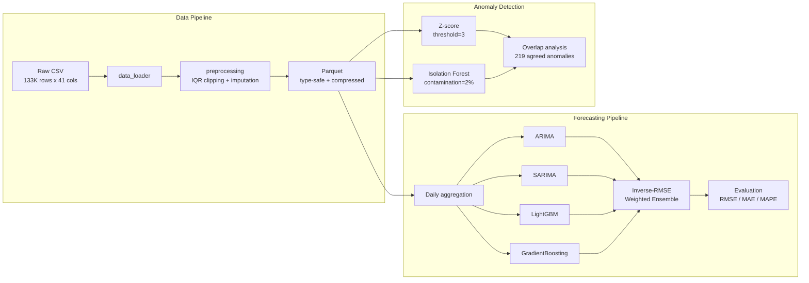

# Global Temperature Forecasting Pipeline — daily temperature prediction across 211 countries

> Predicting daily temperatures across 211 countries with 0.19 °C RMSE using statistical and ML ensemble methods — built for agricultural planning, energy optimization, and climate alert systems.

---

## What It Does

A complete data-science pipeline that forecasts daily temperatures and flags anomalous weather events from raw global weather data.

- **Temperature forecasting** — daily prediction at 0.19 °C RMSE via a weighted ensemble of statistical and ML models
- **Anomaly detection** — flags extreme weather with Z-score and Isolation Forest, plus overlap analysis between methods
- **Reproducible preprocessing** — cleans 133,000+ raw observations into type-safe, compressed Parquet
- **Environmental analysis** — air-quality study and SHAP feature-importance attribution

## What It Is

Global Temperature Forecasting Pipeline is a **research codebase** — sequential Jupyter notebooks backed by a tested `src/` utility package — that turns raw weather CSVs into temperature forecasts and anomaly reports. It targets teams whose planning depends on short-term weather: agriculture (frost/heat alerts, irrigation scheduling), energy (demand prediction, grid balancing), and public safety (extreme-weather warnings).

## Tech Stack

| Layer | Technology |
| --- | --- |
| Language | Python 3.10+ |
| Data processing | pandas, NumPy, PyArrow (Parquet) |
| Forecasting | LightGBM, scikit-learn (GradientBoosting), statsmodels (ARIMA/SARIMA), Prophet |
| Anomaly detection | scikit-learn (Isolation Forest), SciPy / NumPy (Z-score) |
| Testing / CI | pytest, GitHub Actions |

## Architecture



The data pipeline cleans raw CSV into compressed Parquet once; both the forecasting and anomaly-detection pipelines read from that single shared artifact. Forecasting fans out into four models that feed an inverse-RMSE weighted ensemble, while anomaly detection runs two independent methods and reports their overlap rather than either result alone.

## Engineering Decisions

| Decision | Alternative considered | Why this approach |
|----------|----------------------|-------------------|
| IQR clipping for outliers | Z-score removal | Preserves temporal continuity; Z-score drops entire rows, breaking time-series |
| Parquet for processed data | CSV | Type safety, 3-5x compression, schema enforcement via PyArrow |
| Column candidates pattern in data_loader | Hardcoded column names | Handles schema variation across Kaggle dataset versions gracefully |
| PyArrow engine directly | pandas `to_parquet` wrapper | Avoids known Jupyter kernel crash with pandas PyArrow backend |
| Lag + rolling features (1-21 days) | Raw values only | Captures autoregressive structure; drove 75% RMSE improvement for ML models |
| Inverse-RMSE weighted ensemble | Simple average / single best model | Risk diversification; weights reflect demonstrated model accuracy |

## Results

### Forecast Performance

| Model | RMSE (°C) | MAE (°C) | MAPE (%) |
|-------|-----------|----------|----------|
| Prophet (Baseline) | 0.77 | 0.69 | 3.95 |
| ARIMA(5,1,0) | 1.71 | 1.45 | 10.63 |
| SARIMA(1,1,1)(1,1,1,7) | 1.13 | 0.97 | 7.11 |
| LightGBM | **0.19** | **0.16** | **1.25** |
| GradientBoosting | 0.21 | 0.16 | 1.28 |
| Ensemble (Simple Avg) | 0.72 | 0.61 | 4.49 |
| Ensemble (Weighted) | 0.24 | 0.20 | 1.51 |

LightGBM achieves the best individual performance — a 75% RMSE improvement over the Prophet baseline. The weighted ensemble (inverse-RMSE weights: LightGBM 0.455, GradientBoosting 0.415, SARIMA 0.078, ARIMA 0.051) trades a marginal accuracy cost for risk diversification.

### Anomaly Detection

| Method | Anomalies Detected | Share |
|--------|-------------------|-------|
| Z-score (threshold=3) | 930 | 0.70% |
| Isolation Forest (contamination=2%) | 2,667 | 2.00% |
| Both methods agree | 219 | 0.16% |

## Getting Started

### Prerequisites

- Python 3.10+
- pip

### Installation

```bash
git clone https://github.com/LukeSantossz/pma-weather-forecasting.git
cd pma-weather-forecasting
python -m venv .venv && source .venv/bin/activate  # Windows: .venv\Scripts\activate
pip install -r requirements.txt
```

### Running

Execute the notebooks in order — each depends on outputs from previous steps:

```bash
jupyter notebook notebooks/
```

| # | Notebook | Purpose |
|---|----------|---------|
| 1 | `01_dataset_inspection.ipynb` | Load and profile raw data |
| 2 | `02_preprocessing.ipynb` | Clean, handle outliers, export to Parquet |
| 3 | `03_eda.ipynb` | Exploratory analysis and visualizations |
| 4 | `04_anomaly_detection.ipynb` | Z-score and Isolation Forest |
| 5 | `05_prophet_baseline.ipynb` | Prophet forecast baseline |
| 6 | `06_advanced_forecasting.ipynb` | ARIMA, SARIMA, LightGBM, ensemble |
| 7 | `07_environmental_analysis.ipynb` | Air quality and SHAP feature importance |

### Tests

```bash
pytest tests/ -v
```

## Project Structure

```text
pma-weather-forecasting/
├── data/
│   ├── raw/                  # Raw CSV (gitignored)
│   └── processed/            # Cleaned Parquet (gitignored)
├── notebooks/
│   ├── 01_dataset_inspection.ipynb
│   ├── 02_preprocessing.ipynb
│   ├── 03_eda.ipynb
│   ├── 04_anomaly_detection.ipynb
│   ├── 05_prophet_baseline.ipynb
│   ├── 06_advanced_forecasting.ipynb
│   └── 07_environmental_analysis.ipynb
├── src/
│   ├── __init__.py           # Package exports
│   ├── data_loader.py        # Data loading utilities
│   ├── preprocessing.py      # Cleaning pipeline
│   └── parquet_io.py         # Parquet I/O helper
├── tests/
│   ├── test_data_loader.py   # 15 tests
│   └── test_preprocessing.py # 22 tests
├── reports/                  # Exported charts (gitignored)
├── requirements.txt
└── README.md
```

## Project Status

**Status: complete**

### Done

- [x] Preprocessing pipeline — IQR clipping, imputation, type-safe Parquet export
- [x] Five forecasting approaches plus weighted ensemble (best: 0.19 °C RMSE)
- [x] Anomaly detection — Z-score and Isolation Forest with overlap analysis
- [x] Environmental and SHAP feature-importance analysis
- [x] 37 passing unit tests with GitHub Actions CI

### Pending

- [ ] Serving layer for scheduled or on-demand inference
- [ ] Validation on data beyond the current 2-year window

## Known Issues & Limitations

- **Datasets are not bundled** — raw and processed data are gitignored; reproducing the results requires the source Kaggle CSV placed under `data/raw/`.
- **Temporal and geographic scope** — models are fit on roughly 2 years across 211 countries; accuracy on longer horizons or unseen climate regimes is unverified.
- **Ensemble trades accuracy for stability** — the inverse-RMSE ensemble (0.24 °C RMSE) is slightly less accurate than LightGBM alone (0.19 °C); the trade-off buys risk diversification across models.
- **No serving layer** — the pipeline runs as notebooks; there is no API or scheduled-inference component yet.
- **Test coverage is partial** — automated tests cover `data_loader` and `preprocessing`; forecasting and anomaly logic live in notebooks and are validated manually.
