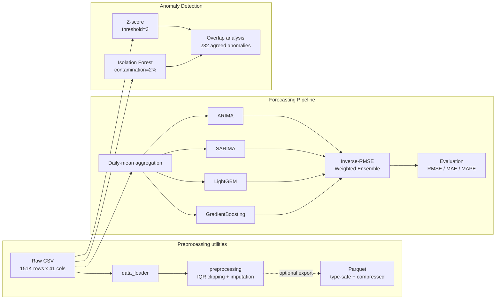

# Global Temperature Forecasting Pipeline

> Forecasting a global daily-mean temperature signal built from 211 countries' data, using statistical and machine-learning ensemble methods, for agricultural, energy, and public-safety planning.

---

## What It Does

A data-science pipeline that forecasts a global daily-mean temperature series and flags anomalous weather events from raw global weather data.

- **Temperature forecasting** — a global daily-mean temperature series from a weighted ensemble of statistical and machine-learning models (built from 211 countries' data, not per-country forecasts)
- **Anomaly detection** — flags extreme weather with Z-score and Isolation Forest, plus overlap analysis between methods
- **Reproducible preprocessing** — cleans 151,000+ raw observations into type-safe, compressed Parquet
- **Environmental analysis** — an air-quality (PM2.5) study with SHAP feature-importance attribution, separate from the temperature forecaster

## What It Is

Global Temperature Forecasting Pipeline is a **research codebase** — sequential Jupyter notebooks backed by a tested `src/` utility package — that turns raw weather CSVs into temperature forecasts and anomaly reports. It targets teams whose planning depends on short-term weather: agriculture (frost/heat alerts, irrigation scheduling), energy (demand prediction, grid balancing), and public safety (extreme-weather warnings).

## Tech Stack

| Layer | Technology |
| --- | --- |
| Language | Python 3.10+ |
| Data processing | pandas, NumPy, PyArrow (Parquet) |
| Forecasting | LightGBM, scikit-learn (GradientBoosting), statsmodels (ARIMA/SARIMA), Prophet |
| Anomaly detection | scikit-learn (Isolation Forest), SciPy / NumPy (Z-score) |
| Testing / CI | pytest, GitHub Actions |

## Architecture



The preprocessing utilities can export a cleaned, compressed Parquet, but that file is an optional export: the forecasting and anomaly-detection notebooks read the raw CSV directly (architecture decision EVO-1(b)). Forecasting fans out into four models that feed an inverse-RMSE weighted ensemble, while anomaly detection runs two independent methods and reports their overlap rather than either result alone.

## Engineering Decisions

| Decision | Alternative considered | Why this approach |
|----------|----------------------|-------------------|
| IQR clipping for outliers | Z-score removal | Preserves temporal continuity; Z-score drops entire rows, breaking time-series |
| Parquet for processed data | CSV | Type safety, 3-5x compression, schema enforcement via PyArrow |
| Column candidates pattern in data_loader | Hardcoded column names | Handles schema variation across Kaggle dataset versions gracefully |
| PyArrow engine directly | pandas `to_parquet` wrapper | Avoids known Jupyter kernel crash with pandas PyArrow backend |
| Lag + rolling features (1-21 days) | Raw values only | Captures autoregressive structure; under the leakage-free evaluation (#20) the ML models (RMSE 0.27-0.32) clearly beat the classical baselines (0.73-0.80) |
| Inverse-RMSE weighted ensemble | Simple average / single best model | Risk diversification; weights are set from validation-set accuracy, not the test set |

## Results

### Forecast Performance

| Model | RMSE (°C) | MAE (°C) | MAPE (%) |
|-------|-----------|----------|----------|
| GradientBoosting | 0.27 | 0.22 | 0.96 |
| LightGBM | 0.32 | 0.25 | 1.06 |
| Ensemble (Weighted) | 0.35 | 0.28 | 1.22 |
| Ensemble (Simple Avg) | 0.47 | 0.38 | 1.61 |
| ARIMA(5,1,0) | 0.73 | 0.57 | 2.43 |
| Prophet (Baseline) | 0.77 | 0.69 | 3.95 |
| SARIMA(1,1,1)(1,1,1,7) | 0.80 | 0.62 | 2.62 |

All rows come from a single leakage-free evaluation on the current dataset (2024-05-16 to 2026-07-03): the final 30 days are held out as the test window and scored exactly once. Both LightGBM's early stopping and the weighted ensemble's inverse-RMSE weights are fit on a validation slice carved from the training window, never on the test set (issue [#20](https://github.com/LukeSantossz/weather-forecast/issues/20)). GradientBoosting is the strongest single model at 0.27 °C RMSE, with LightGBM close behind at 0.32; both clearly beat the classical baselines (ARIMA 0.73, Prophet 0.77, SARIMA 0.80). The inverse-RMSE weighted ensemble (0.35) lands between them: it underperforms the best single model because ARIMA and SARIMA still carry about 24% of the weight and pull its predictions off. The earlier headline figure, produced under evaluation leakage, was withdrawn under #20; these numbers replace it.

### Anomaly Detection

| Method | Anomalies Detected | Share |
|--------|-------------------|-------|
| Z-score (threshold=3) | 990 | 0.66% |
| Isolation Forest (contamination=2%) | 3,021 | 2.00% |
| Both methods agree | 232 | 0.15% |

## Getting Started

### Prerequisites

- Python 3.10+
- pip

### Installation

```bash
git clone https://github.com/LukeSantossz/weather-forecast.git
cd weather-forecast
python -m venv .venv && source .venv/bin/activate  # Windows: .venv\Scripts\activate
pip install -r requirements.txt
```

### Running

Run the notebooks. Each reads the raw CSV directly, so they run independently; the numbering is only a suggested reading order, and notebook 02's Parquet export is optional (EVO-1(b)):

```bash
jupyter notebook notebooks/
```

| # | Notebook | Purpose |
|---|----------|---------|
| 1 | `01_dataset_inspection.ipynb` | Load and profile raw data |
| 2 | `02_preprocessing.ipynb` | Clean, handle outliers, export to Parquet |
| 3 | `03_eda.ipynb` | Exploratory analysis and visualizations |
| 4 | `04_anomaly_detection.ipynb` | Z-score and Isolation Forest |
| 5 | `05_prophet_baseline.ipynb` | Prophet forecast baseline |
| 6 | `06_advanced_forecasting.ipynb` | ARIMA, SARIMA, LightGBM, ensemble |
| 7 | `07_environmental_analysis.ipynb` | Air quality and SHAP feature importance |

### Tests

```bash
pytest tests/ -v
```

### API

A FastAPI service serves the trained pipeline over HTTP ([#16](https://github.com/LukeSantossz/weather-forecast/issues/16)). Install the serving extra and run it locally:

```bash
pip install -e ".[serving]"
uvicorn weather_forecast.api.app:app --reload
```

Or with Docker:

```bash
docker compose up --build
```

The service loads a persisted forecaster from the directory named by `MODELS_DIR` (default `models/`). Create one with the training CLI:

```bash
python -m weather_forecast.train --save
```

| Method | Path | Purpose |
|--------|------|---------|
| GET | `/health` | Liveness probe; reports whether a forecaster is loaded |
| POST | `/anomaly` | Score a batch of observations with the Z-score and Isolation Forest detectors |
| POST | `/forecast` | Forecast N steps from the persisted forecaster (`503` if none is loaded) |

Interactive OpenAPI docs are served at `/docs`. Example requests:

```bash
curl http://localhost:8000/health

curl -X POST http://localhost:8000/forecast \
  -H "Content-Type: application/json" \
  -d '{"horizon": 7}'

curl -X POST http://localhost:8000/anomaly \
  -H "Content-Type: application/json" \
  -d '{"observations": [{"temperature_celsius": 21.0, "humidity": 50, "wind_kph": 10, "pressure_mb": 1012, "precip_mm": 0}]}'
```

## Project Structure

```text
weather-forecast/
├── data/
│   ├── raw/                  # Raw CSV (gitignored)
│   └── processed/            # Cleaned Parquet (gitignored)
├── notebooks/
│   ├── 01_dataset_inspection.ipynb
│   ├── 02_preprocessing.ipynb
│   ├── 03_eda.ipynb
│   ├── 04_anomaly_detection.ipynb
│   ├── 05_prophet_baseline.ipynb
│   ├── 06_advanced_forecasting.ipynb
│   └── 07_environmental_analysis.ipynb
├── src/
│   ├── __init__.py           # Package exports
│   ├── data_loader.py        # Data loading utilities
│   ├── preprocessing.py      # Cleaning pipeline
│   ├── parquet_io.py         # Parquet I/O helper
│   ├── dashboard_export.py   # Dashboard JSON data-contract export
│   └── conformal.py          # Split-conformal prediction intervals
├── tests/
│   ├── test_data_loader.py      # 20 tests
│   ├── test_preprocessing.py    # 27 tests
│   ├── test_parquet_io.py       # 5 tests
│   ├── test_dashboard_export.py # 18 tests
│   └── test_conformal.py        # 14 tests
├── reports/                  # Exported charts (gitignored)
├── requirements.txt
└── README.md
```

## Project Status

**Status: complete**

### Done

- [x] Preprocessing pipeline — IQR clipping, imputation, type-safe Parquet export
- [x] Five forecasting approaches plus weighted ensemble, all scored under a leakage-free evaluation (#20)
- [x] Anomaly detection — Z-score and Isolation Forest with overlap analysis
- [x] Environmental analysis with SHAP feature-importance for a PM2.5 air-quality model
- [x] FastAPI serving layer (`/health`, `/anomaly`, `/forecast`) with a Docker image (#16)
- [x] Passing unit tests with GitHub Actions CI

### Pending

- [ ] Validation on data beyond the current 2-year window

## Known Issues & Limitations

- **Datasets are not bundled** — raw and processed data are gitignored; reproducing the results requires the source Kaggle CSV placed under `data/raw/`.
- **Temporal and geographic scope** — the model forecasts a global daily-mean series built from roughly 2 years of data across 211 countries; it is not a per-country forecast, and accuracy on longer horizons or unseen climate regimes is unverified.
- **Evaluation leakage (resolved, [#20](https://github.com/LukeSantossz/weather-forecast/issues/20))** — an earlier version passed the held-out test set to LightGBM as its early-stopping validation set and then scored it, deflating the reported RMSE. The fix carves the early-stopping validation slice from the training window and scores the test window exactly once; the results table now reflects the corrected, leakage-free metrics on the current dataset. The inflated headline figure it once produced is not reproduced anywhere.
- **No serving layer** — the pipeline runs as notebooks; there is no API or scheduled-inference component yet.
- **Test coverage is partial** — automated tests cover `data_loader`, `preprocessing`, `parquet_io`, `dashboard_export`, and `conformal`; forecasting and anomaly logic live in notebooks and are validated manually.

## Contributing

Contributions follow the development standards in the [`.standards`](.standards) submodule (spec at the Gate, test-first, Conventional Commits, R1/R2/R3 review). See [CONTRIBUTING.md](CONTRIBUTING.md) for the workflow and setup.

## License

Released under the [MIT License](LICENSE).
