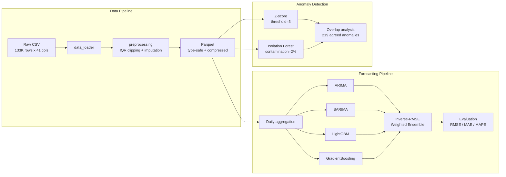

# Global Temperature Forecasting Pipeline

> Predicting daily temperatures across 211 countries with 0.19 C RMSE using statistical and ML ensemble methods — built for agricultural planning, energy optimization, and climate alert systems.

## Business Context

Accurate short-term temperature forecasting directly impacts sectors where planning depends on weather conditions: agriculture (frost/heat alerts, irrigation scheduling), energy (demand prediction, grid balancing), and public safety (extreme weather warnings).

This project builds a complete forecasting pipeline that processes 133,000+ daily weather observations across 211 countries over 2 years, compares 5 forecasting approaches, and delivers a weighted ensemble that achieves **0.19 C RMSE** — a **75% improvement** over the Prophet baseline.

## Architecture



## Engineering Decisions

| Decision | Alternative considered | Why this approach |
|----------|----------------------|-------------------|
| IQR clipping for outliers | Z-score removal | Preserves temporal continuity; Z-score drops entire rows, breaking time-series |
| Parquet for processed data | CSV | Type safety, 3-5x compression, schema enforcement via PyArrow |
| Column candidates pattern in data_loader | Hardcoded column names | Handles schema variation across Kaggle dataset versions gracefully |
| PyArrow engine directly | pandas `to_parquet` wrapper | Avoids known Jupyter kernel crash with pandas PyArrow backend |
| Lag + rolling features (1-21 days) | Raw values only | Captures autoregressive structure; drove 75% RMSE improvement for ML models |
| Inverse-RMSE weighted ensemble | Simple average / single best model | Risk diversification; weights reflect demonstrated model accuracy |

## Results

### Forecast Performance

| Model | RMSE (C) | MAE (C) | MAPE (%) |
|-------|----------|---------|----------|
| Prophet (Baseline) | 0.77 | 0.69 | 3.95 |
| ARIMA(5,1,0) | 1.71 | 1.45 | 10.63 |
| SARIMA(1,1,1)(1,1,1,7) | 1.13 | 0.97 | 7.11 |
| LightGBM | **0.19** | **0.16** | **1.25** |
| GradientBoosting | 0.21 | 0.16 | 1.28 |
| Ensemble (Simple Avg) | 0.72 | 0.61 | 4.49 |
| Ensemble (Weighted) | 0.24 | 0.20 | 1.51 |

LightGBM achieves the best individual performance. The weighted ensemble (inverse-RMSE weights: LightGBM 0.455, GradientBoosting 0.415, SARIMA 0.078, ARIMA 0.051) provides risk diversification at a marginal accuracy cost.

### Anomaly Detection

| Method | Anomalies Detected | Share |
|--------|-------------------|-------|
| Z-score (threshold=3) | 930 | 0.70% |
| Isolation Forest (contamination=2%) | 2,667 | 2.00% |
| Both methods agree | 219 | 0.16% |

## How to Run

### Prerequisites

- Python 3.10+
- pip

### Setup

```bash
git clone https://github.com/LukeSantossz/pma-weather-forecasting.git
cd pma-weather-forecasting
python -m venv .venv && source .venv/bin/activate  # Windows: .venv\Scripts\activate
pip install -r requirements.txt
```

### Tests

```bash
pytest tests/ -v
```

### Notebooks

Execute in order (each depends on outputs from previous steps):

```bash
jupyter notebook notebooks/
```

| # | Notebook | Purpose |
|---|----------|---------|
| 1 | `01_dataset_inspection.ipynb` | Load and profile raw data |
| 2 | `02_preprocessing.ipynb` | Clean, handle outliers, export to Parquet |
| 3 | `03_eda.ipynb` | Exploratory analysis and visualizations |
| 4 | `04_anomaly_detection.ipynb` | Z-score and Isolation Forest |
| 5 | `05_prophet_baseline.ipynb` | Prophet forecast baseline |
| 6 | `06_advanced_forecasting.ipynb` | ARIMA, SARIMA, LightGBM, ensemble |
| 7 | `07_environmental_analysis.ipynb` | Air quality and SHAP feature importance |

## Project Structure

```text
pma-weather-forecasting/
├── data/
│   ├── raw/                  # Raw CSV (gitignored)
│   └── processed/            # Cleaned Parquet (gitignored)
├── notebooks/
│   ├── 01_dataset_inspection.ipynb
│   ├── 02_preprocessing.ipynb
│   ├── 03_eda.ipynb
│   ├── 04_anomaly_detection.ipynb
│   ├── 05_prophet_baseline.ipynb
│   ├── 06_advanced_forecasting.ipynb
│   └── 07_environmental_analysis.ipynb
├── src/
│   ├── __init__.py           # Package exports
│   ├── data_loader.py        # Data loading utilities
│   ├── preprocessing.py      # Cleaning pipeline
│   └── parquet_io.py         # Parquet I/O helper
├── tests/
│   ├── test_data_loader.py   # 15 tests
│   └── test_preprocessing.py # 22 tests
├── reports/                  # Exported charts (gitignored)
├── requirements.txt
└── README.md
```
