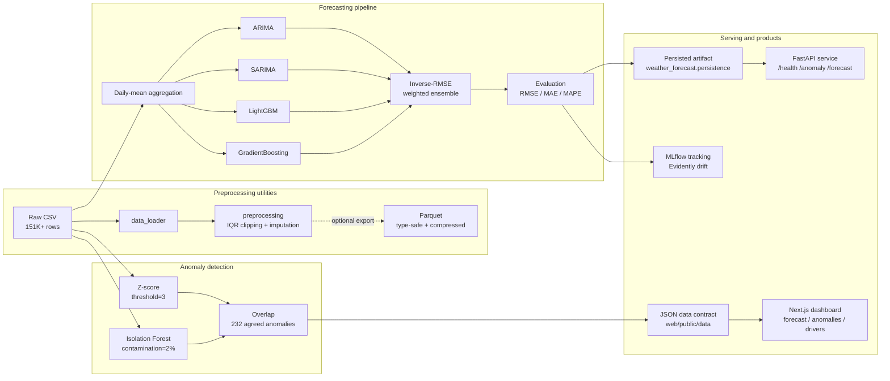

# Global Temperature Forecasting Pipeline

> Forecasts a global daily-mean temperature series built from 211 countries' readings, and flags
> anomalous weather, using statistical and machine-learning models. Built for planning that
> depends on short-term weather: agriculture, energy, and public safety.

**Live dashboard: <https://weather-forecast-neon-iota.vercel.app>**

> **Fresh clone, no dataset needed.** The test suite and the dashboard both run as they are; the
> dashboard's data is committed as JSON. Anything that retrains a model needs the source CSV,
> which is not in this repository. See [The dataset](#the-dataset). External services: none for
> the pipeline; the dashboard map pulls basemap tiles, and semantic search downloads its
> embedding model on first use.

---

## What It Does

Turns raw global weather observations into a temperature forecast, an anomaly report, and a
dashboard that a reader can operate.

- **Forecasts** a global daily-mean temperature series from four models (ARIMA, SARIMA,
  LightGBM, GradientBoosting) combined into a simple and an inverse-RMSE weighted ensemble.
- **Detects anomalies** with two independent methods (Z-score on temperature, Isolation Forest
  over five weather features) and reports where they agree.
- **Serves** forecasts and batch anomaly scoring over HTTP, from a persisted, versioned model
  artifact.
- **Scores a reading in the browser.** The dashboard runs the same Isolation Forest client-side
  from an exported model file, with no server call. It matches the Python detector to 1e-6, and
  a test asserts that on every run.
- **Searches anomalies in natural language** with sentence-transformer embeddings and cosine
  similarity, with no external service and no API key.
- **Cleans** raw observations into a type-safe, compressed Parquet store (imputation, IQR
  clipping, scaling, bounded one-hot encoding).
- **Attributes air-quality drivers** with SHAP, on a separate PM2.5 model.

## What It Is

An installable Python package (`weather_forecast`) with four surfaces built on it: a training
CLI, a FastAPI service, a static Next.js dashboard, and seven Jupyter notebooks that carry the
analytical narrative and generate the dashboard's data files. The pipeline is the product; the
notebooks are the write-up.

It is built for teams whose planning depends on short-term weather: agriculture (frost and heat
alerts, irrigation), energy (demand, grid balancing), and public safety (extreme-weather
warnings). It forecasts one global daily-mean series, not a forecast per country.

## Tech Stack

| Layer | Technology |
| --- | --- |
| Language | Python 3.10+, TypeScript |
| Data processing | pandas, NumPy, PyArrow (Parquet) |
| Forecasting | LightGBM, scikit-learn (GradientBoosting), statsmodels (ARIMA/SARIMA), Prophet (notebook baseline) |
| Anomaly detection | scikit-learn (Isolation Forest), NumPy (Z-score) |
| Serving | FastAPI, Uvicorn, Docker (multi-stage) |
| MLOps | MLflow (tracking), Evidently (drift) |
| Semantic search | sentence-transformers (`all-MiniLM-L6-v2`) |
| Dashboard | Next.js 16 (static export), React 19, Astryx design system (Meta Open Source), D3, MapLibre |
| Packaging and CI | hatchling, pytest, vitest, ruff, mypy, GitHub Actions |

## Architecture


```mermaid
flowchart LR
    A[Raw CSV<br/>151K+ rows]

    subgraph Preprocessing utilities
        A --> B[data_loader]
        B --> C[preprocessing<br/>IQR clipping + imputation]
        C -. optional export .-> D[Parquet<br/>type-safe + compressed]
    end

    subgraph Forecasting pipeline
        A --> E[Daily-mean aggregation]
        E --> F[ARIMA]
        E --> G[SARIMA]
        E --> H[LightGBM]
        E --> I[GradientBoosting]
        F & G & H & I --> J[Inverse-RMSE<br/>weighted ensemble]
        J --> K[Evaluation<br/>RMSE / MAE / MAPE]
    end

    subgraph Anomaly detection
        A --> L[Z-score<br/>threshold=3]
        A --> M[Isolation Forest<br/>contamination=2%]
        L & M --> N[Overlap<br/>232 agreed anomalies]
    end

    subgraph Serving and products
        K --> P[Persisted artifact<br/>weather_forecast.persistence]
        P --> Q[FastAPI service<br/>/health /anomaly /forecast]
        K --> R[MLflow tracking<br/>Evidently drift]
        N --> S[JSON data contract<br/>web/public/data]
        S --> T[Next.js dashboard<br/>forecast / anomalies / drivers]
    end
```

Two things in this topology are not obvious.

First, the Parquet store is optional. Forecasting and anomaly detection read the raw CSV
directly; the cleaned Parquet is an export that notebook 02 produces and nothing downstream
requires (architecture decision EVO-1(b)).

Second, the dashboard has no backend. It is a static export that reads committed JSON, and its
anomaly checker runs the exported Isolation Forest in the browser. Python owns the fit;
JavaScript only walks the trees ([ADR 0011](docs/adr/0011-browser-inference-exported-artifact.md),
[ADR 0012](docs/adr/0012-tree-traversal-primitive.md)).

## Engineering Decisions

The hard-to-reverse decisions, each recorded as an ADR under [`docs/adr/`](docs/adr/). See
[ADR 0001](docs/adr/0001-decision-records-flow.md) for how they get promoted.

| Decision | ADR |
|----------|-----|
| IQR clipping for outliers (preserves temporal continuity) | [0005](docs/adr/0005-iqr-outlier-clipping.md) |
| Parquet for the processed store (type safety, compression) | [0006](docs/adr/0006-parquet-processed-store.md) |
| Column-candidates loader (handles dataset-version drift) | [0007](docs/adr/0007-column-candidates-loader.md) |
| PyArrow engine directly (avoids a Jupyter kernel crash) | [0008](docs/adr/0008-pyarrow-engine-direct.md) |
| Lag and rolling features (captures autoregressive structure) | [0009](docs/adr/0009-lag-rolling-features.md) |
| Inverse-RMSE weighted ensemble (risk diversification) | [0010](docs/adr/0010-inverse-rmse-ensemble.md) |
| Observatory identity, single-scroll page, self-hosted fonts | [0002](docs/adr/0002-observatory-identity.md), [0003](docs/adr/0003-single-scroll-narrative.md), [0004](docs/adr/0004-nextfont-typography.md) |
| Browser inference from an exported artifact (static export, Python owns the model) | [0011](docs/adr/0011-browser-inference-exported-artifact.md) |
| Tree traversal as the shared client-side inference primitive | [0012](docs/adr/0012-tree-traversal-primitive.md) |

## Results

### Forecast performance

| Model | RMSE (°C) | MAE (°C) | MAPE (%) |
|-------|-----------|----------|----------|
| **GradientBoosting** | **0.27** | **0.22** | **0.96** |
| LightGBM | 0.32 | 0.25 | 1.06 |
| Ensemble (weighted) | 0.35 | 0.28 | 1.22 |
| Ensemble (simple average) | 0.47 | 0.38 | 1.61 |
| ARIMA(5,1,0) | 0.73 | 0.57 | 2.43 |
| SARIMA(1,1,1)(1,1,1,7) | 0.80 | 0.61 | 2.62 |
| Prophet (baseline, separate run) | 0.77 | 0.69 | 3.95 |

The six package models come from one leakage-free evaluation on the current dataset (2024-05-16
to 2026-07-03). The final 30 days are held out and scored exactly once. LightGBM's early
stopping and the ensemble's inverse-RMSE weights are both fit on a validation slice carved out
of the training window, never on the test window (issue
[#20](https://github.com/LukeSantossz/weather-forecast/issues/20)).

GradientBoosting is the strongest single model at 0.27 °C RMSE, with LightGBM at 0.32. Both
beat the classical baselines. The weighted ensemble (0.35) lands between them: ARIMA and SARIMA
still carry about 24% of the weight and pull its predictions off. The earlier headline figure,
produced under evaluation leakage, was withdrawn under #20 and is not reproduced anywhere.

The Prophet row is a separate run. There is no Prophet trainer in the package; the figure comes
from notebook 05, which uses the same 30-day holdout but is scored outside `run_forecast`.

Every number in the table is in [`web/public/data/metrics.json`](web/public/data/metrics.json),
the file the dashboard renders, and the holdout window and the 90 days of history before it are in
[`forecast.json`](web/public/data/forecast.json) beside it. Two figures on this page come from the
run that produced those files rather than from the files themselves: the dataset's start date, and
the 211 countries the daily mean averages over. With the dataset in place, one command reproduces
the six package rows:

```bash
python -m weather_forecast.train --project-root .
```

### Anomaly detection

| Method | Anomalies detected | Share |
|--------|-------------------|-------|
| Z-score (threshold=3) | 990 | 0.66% |
| Isolation Forest (contamination=2%) | 3,021 | 2.00% |
| Both methods agree | 232 | 0.15% |

Source: [`web/public/data/anomalies.json`](web/public/data/anomalies.json), over 151,000 raw
observations.

## Getting Started

### Prerequisites

- Python 3.10 or newer, and `pip`.
- Node.js 20.9 or newer, for the dashboard only.
- Docker, for the containerized API only.

### Installation

```bash
git clone --recurse-submodules https://github.com/LukeSantossz/weather-forecast.git
cd weather-forecast
python -m venv .venv && source .venv/bin/activate  # Windows: .venv\Scripts\activate
pip install -e ".[dev,serving,mlops]"
```

`--recurse-submodules` populates [`.standards`](.standards), the development standards this
project follows. If you already cloned without it, run `git submodule update --init`.

The install above is what CI uses and what runs the whole test suite. Two other sets of
dependencies are optional:

| Command | Adds |
|---------|------|
| `pip install -e ".[nlp]"` | sentence-transformers, for semantic search (pulls PyTorch) |
| `pip install -r requirements.txt` | the notebook environment: Prophet, SHAP, matplotlib, seaborn, plotly |

### The dataset

The raw data is not in this repository. It is the Kaggle dataset
[World Weather Repository (Daily Updating)](https://www.kaggle.com/datasets/nelgiriyewithana/global-weather-repository).
Download it and save the CSV as:

```text
data/raw/GlobalWeatherRepository.csv
```

That exact path and file name are what `weather_forecast.data_loader` reads. The dataset updates
daily, so a fresh download will not reproduce the metrics above exactly; those were produced from
a snapshot covering 2024-05-16 to 2026-07-03.

You need the CSV for the training CLI, the drift CLI, the notebooks, and anything that persists a
forecaster. You do **not** need it for the test suite, the dashboard, or semantic search, which
all read committed files.

### Running the pipeline

Train, evaluate, and print per-model metrics:

```bash
python -m weather_forecast.train --project-root .
```

Add `--save` to persist a forecaster under `models/`, and `--track` to log the run to MLflow.

Or read the notebooks. Each one loads the raw CSV itself, so they run independently; the
numbering is a suggested reading order.

```bash
pip install -r requirements.txt
jupyter notebook notebooks/
```

| # | Notebook | Purpose |
|---|----------|---------|
| 1 | `01_dataset_inspection.ipynb` | Load and profile the raw data |
| 2 | `02_preprocessing.ipynb` | Clean, treat outliers, export to Parquet |
| 3 | `03_eda.ipynb` | Exploratory analysis and figures |
| 4 | `04_anomaly_detection.ipynb` | Z-score and Isolation Forest |
| 5 | `05_prophet_baseline.ipynb` | Prophet forecast baseline |
| 6 | `06_advanced_forecasting.ipynb` | ARIMA, SARIMA, LightGBM, ensemble |
| 7 | `07_environmental_analysis.ipynb` | Air quality and SHAP attribution |

Notebooks 04, 06, and 07 also write the dashboard's real data files. See
[Dashboard](#dashboard).

### Tests

```bash
pytest tests/ -q
```

160 tests, all offline, all seeded. They build their own fixtures, so no dataset is required.
Tests whose dependency lives in an optional extra skip when that extra is absent: 6 API tests
need `serving`, 8 drift and tracking tests need `mlops`, and 3 semantic-search tests need `nlp`.
The install above covers `serving` and `mlops`, so it runs 157 and skips 3.

Lint and type checks, the same three CI runs:

```bash
ruff check .
ruff format --check .
mypy src/
```

### Dashboard

Live at <https://weather-forecast-neon-iota.vercel.app>, deployed from `main` on every push
(Vercel, root directory `web`, no server functions, no environment variables). See
[`web/DEPLOY.md`](web/DEPLOY.md).

A Next.js static export in `web/`. One page, three sections: **Forecast** (history and holdout
with per-model toggles, plus the metrics table), **Anomalies** (a MapLibre map, a records list,
the semantic-search demo, and the in-browser anomaly checker), and **Drivers** (SHAP
attribution). A tabbed layout was deliberately removed
([ADR 0003](docs/adr/0003-single-scroll-narrative.md)) and `npm run check` fails if one comes
back.

```bash
cd web
npm ci
npm run build     # writes the static site to web/out
npm run preview   # serves web/out locally
```

Or `npm run dev` for the dev server. The dashboard's own checks:

```bash
npm test          # vitest, including the Python-parity tests for browser inference
npm run check     # acceptance checks; requires a prior npm run build
```

The dashboard reads the JSON data contract in `web/public/data/`, validated against the JSON
schemas beside it in `web/public/data/schema/`. It has one runtime network dependency: the
anomaly map pulls its basemap style and vector tiles from the CARTO basemaps CDN, which needs no
API key. Offline, the map renders empty and the rest of the page still works.

Provenance is part of the UI. The banner renders `Live model output · commit <sha> · <date>` or
`Preview data · layout sample, not model output`, driven by the data's own `data_status` field.
A metric row can render a pending state instead of a number the project no longer stands behind,
and the export code refuses to label synthetic data as real.

To regenerate the real data files, run from the repository root, with the dataset in place:
execute notebooks 04, 06, and 07, then `python scripts/_gen_anomaly_model.py` for the browser
inference artifact, then `python -m weather_forecast.semantic_search --build-embeddings
web/public/data/anomaly_embeddings.json` for the search embeddings.

`python -m weather_forecast.dashboard_export` does **not** do this. Its CLI accepts only
`--data-status sample` and defaults its output to `web/public/data`, so running it in place
replaces the real contract with synthetic placeholder data.

### Experiment tracking and drift monitoring

Log a run's parameters, per-model metrics, and saved artifact to a local MLflow file store under
`mlruns/`:

```bash
python -m weather_forecast.train --save --track
mlflow ui   # needs the full mlflow package; the mlops extra pins mlflow-skinny, which has no server
```

Report data drift between an earlier reference window and the most recent window of the daily
series:

```bash
python -m weather_forecast.drift --window-days 30 --html reports/drift.html
```

It prints a JSON summary (`dataset_drift`, `drifted_columns`, `share`, and per-column K-S
p-values). A column is flagged when its p-value falls below 0.05; the dataset is flagged when at
least half the checked columns drift.

### Semantic search

Search the detected anomalies in natural language. Sentence-transformer embeddings with an
in-memory cosine search: no inference service, no API key, no cost per query. The model weights
download from Hugging Face the first time and are cached, so later runs work offline.

```bash
pip install -e ".[nlp]"
python -m weather_forecast.semantic_search --query "extreme heat events" --top-k 5
```

This reads the committed `web/public/data/anomalies.json`, so it needs no dataset. To rebuild the
embeddings the dashboard ships:

```bash
python -m weather_forecast.semantic_search --build-embeddings web/public/data/anomaly_embeddings.json
```

The dashboard exposes this as a browser-side demo. Selecting one of the precomputed example
queries ranks the anomaly records by cosine similarity in the browser, with no model and no
network beyond the static JSON.

## API Reference

A FastAPI service over the trained pipeline
([#16](https://github.com/LukeSantossz/weather-forecast/issues/16)). Run it from the repository
root:

```bash
uvicorn weather_forecast.api.app:app --reload
```

Or in Docker:

```bash
docker compose up --build
```

| Method | Path | Purpose |
|--------|------|---------|
| GET | `/health` | Liveness probe; reports whether a forecaster is loaded |
| POST | `/anomaly` | Score a batch of at least 10 observations with both detectors |
| POST | `/forecast` | Forecast N steps from the persisted forecaster; `503` if none is loaded |

`/health` and `/anomaly` work immediately. `/forecast` needs a persisted artifact, and a fresh
clone has none, so it returns `503` until you create one:

```bash
python -m weather_forecast.train --save
```

The service reads that artifact from the directory named by `MODELS_DIR` (default `models/`).
That is the only environment variable you need to run anything here. The dashboard reads an
optional `NEXT_PUBLIC_SITE_URL` at build time, used only to make Open Graph image URLs absolute;
without it, local builds fall back to `http://localhost:3000`.

`/forecast` serves the ARIMA model that `train --save` persists, which was the simplest model to
serve first. `/anomaly` scores a batch **relative to itself**: the detectors fit on the rows you
submit, so it finds outliers within a submission and rejects batches under 10 rows with HTTP 422.

Interactive OpenAPI docs are at `/docs`. Examples:

```bash
curl http://localhost:8000/health

curl -X POST http://localhost:8000/forecast \
  -H "Content-Type: application/json" \
  -d '{"horizon": 7}'
```

`/anomaly` needs a real batch. Build one and post it (POSIX shell; on Windows, write the JSON to
a file first and post that):

```bash
python - <<'PY' | curl -X POST http://localhost:8000/anomaly \
  -H "Content-Type: application/json" -d @-
import json
rows = [{"temperature_celsius": 20.0 + i, "humidity": 50, "wind_kph": 10,
         "pressure_mb": 1012, "precip_mm": 0} for i in range(12)]
rows[-1]["temperature_celsius"] = 60.0  # an outlier within the batch
print(json.dumps({"observations": rows}))
PY
```

## Project Structure

```text
weather-forecast/
├── src/weather_forecast/      # The installable package (hatchling)
│   ├── data_loader.py         # Raw CSV loading + column resolution
│   ├── preprocessing.py       # IQR clipping, imputation, one-hot
│   ├── parquet_io.py          # Type-safe Parquet I/O
│   ├── features.py            # Lag / rolling / calendar features (leakage-safe)
│   ├── models.py              # ARIMA, SARIMA, LightGBM, GB, ensembling
│   ├── anomaly.py             # Z-score + Isolation Forest, and the browser export
│   ├── evaluation.py          # RMSE / MAE / MAPE
│   ├── config.py              # Frozen config + global seed
│   ├── logging_setup.py       # Structured logging
│   ├── train.py               # End-to-end forecast + training CLI
│   ├── persistence.py         # Versioned model artifacts + metadata
│   ├── conformal.py           # Split-conformal prediction intervals
│   ├── dashboard_export.py    # Dashboard JSON data-contract export
│   ├── tracking.py            # MLflow experiment tracking
│   ├── drift.py               # Evidently data-drift reporting
│   ├── semantic_search.py     # sentence-transformer anomaly search
│   └── api/                   # FastAPI app + Pydantic schemas
├── tests/                     # 160 tests (pytest)
├── notebooks/                 # 01-07 narrative; 04/06/07 emit the real data contract
├── scripts/                   # Browser-inference artifact + parity-fixture generators
├── web/                       # Next.js dashboard (static export, Astryx)
│   ├── lib/inference/         # Client-side Isolation Forest, z-score, feature builders
│   └── public/data/           # JSON data contract + JSON schemas
├── docs/adr/                  # Architecture decision records
├── docs/specs/                # Numbered SPECs (spec-first workflow)
├── .github/workflows/         # ci.yml (Python) and web-ci.yml (dashboard)
├── Dockerfile, docker-compose.yml
├── pyproject.toml             # Core deps + dev/serving/mlops/nlp/notebooks extras
├── data/, reports/, models/   # Gitignored working directories
└── README.md
```

## Project Status

**Status: MVP complete.** The pipeline, anomaly detection, serving API, and dashboard all work
end to end, and every CI gate passes. On Python 3.10 and 3.11 the suite reports 157 passed and 3
skipped, and the 3 it skips are the model-backed search tests, which run in their own job with the
`nlp` extra installed. Alongside those: ruff, mypy, the Docker image build, and the dashboard
build, acceptance checks and parity tests. The items under Pending are follow-ups, not holes in
the core.

### Done

- [x] Pipeline extracted into an installable, tested `src/weather_forecast` package with a training CLI ([#14](https://github.com/LukeSantossz/weather-forecast/issues/14))
- [x] Preprocessing: IQR clipping, imputation, type-safe Parquet export
- [x] Four forecasters plus simple and weighted ensembles, scored under a leakage-free evaluation ([#20](https://github.com/LukeSantossz/weather-forecast/issues/20))
- [x] Anomaly detection: Z-score and Isolation Forest with overlap analysis
- [x] SHAP feature attribution for a PM2.5 air-quality model
- [x] Versioned model persistence with dependency and metric lineage ([#15](https://github.com/LukeSantossz/weather-forecast/issues/15))
- [x] FastAPI serving layer with a Docker image ([#16](https://github.com/LukeSantossz/weather-forecast/issues/16))
- [x] MLflow tracking and Evidently drift monitoring ([#17](https://github.com/LukeSantossz/weather-forecast/issues/17))
- [x] Semantic search over anomalies, with a browser-side demo ([#32](https://github.com/LukeSantossz/weather-forecast/issues/32))
- [x] Next.js dashboard with sample/real provenance carried in the data itself
- [x] In-browser anomaly checker: exported Isolation Forest scored client-side, parity-tested against Python to 1e-6
- [x] GitHub Actions CI: Python test matrix, lint, Docker build, NLP job, and a separate dashboard workflow
- [x] Dashboard published on Vercel, deploying from `main` on every push ([#64](https://github.com/LukeSantossz/weather-forecast/issues/64))

### Pending

- [ ] Make the package the single source of the published numbers; notebook 06 re-fits the models inline instead of calling `run_forecast`
- [ ] Regenerate the committed data contract, which was produced 122 commits before the current `main`
- [ ] Re-score the Prophet baseline through the package, or drop it from the table
- [ ] Wire conformal prediction intervals into the forecast output; the module is built and tested but reaches no user-facing surface
- [ ] Rolling-origin backtesting, to replace the single 30-day holdout
- [ ] Serve the stronger feature-based forecaster instead of ARIMA
- [ ] Free-text query embedding in the browser, instead of precomputed example queries
- [ ] Client-side forecast studio, re-forecasting live from edited history ([#63](https://github.com/LukeSantossz/weather-forecast/issues/63))

## Known Issues & Limitations

- **The dataset is not bundled.** Raw and processed data are gitignored. Reproducing the training
  results needs the Kaggle CSV at `data/raw/GlobalWeatherRepository.csv`, and because that dataset
  updates daily, a fresh download covers a different window than the published metrics.
- **The live dashboard shows the snapshot's provenance.** Its banner reports the commit that
  produced the committed JSON, not the commit that is deployed, because the data contract has not
  been regenerated since. Refreshing it needs the source CSV.
- **Narrow temporal and geographic scope.** One global daily-mean series over roughly two years
  of data across 211 countries. It is not a per-country forecast, and accuracy on longer horizons
  or unseen climate regimes is unverified.
- **Single-holdout evaluation.** The comparison rests on one 30-day window scored once, so the
  ranking and the 0.27 °C figure carry variance nobody has quantified.
- **Two implementations of the same pipeline.** The notebooks that produce the published
  dashboard numbers re-fit the forecasting models inline instead of calling the package. The
  numbers currently agree to the published precision, but nothing enforces that: a change to
  `models.py` can stale the dashboard while the tests stay green.
- **The committed data contract is a snapshot.** Because the source CSV is gitignored, CI cannot
  regenerate or verify `web/public/data/`. It has to be refreshed by hand before publishing.
- **Conformal intervals are unwired.** `conformal.py` is implemented and tested, but no
  prediction interval reaches the forecast output or any UI.
- **Batch-relative anomaly API.** `POST /anomaly` scores each batch against itself rather than a
  persisted reference distribution, so it needs at least 10 rows and finds outliers within a
  submission.
- **ARIMA-only serving.** `/forecast` serves the persisted ARIMA model (0.73 °C RMSE), not
  GradientBoosting or LightGBM (0.27 to 0.32), which need feature engineering at inference time.
- **Evaluation leakage, resolved.** An earlier version passed the held-out test set to LightGBM
  as its early-stopping validation set and then scored it, deflating the reported RMSE. The fix
  carves that slice from the training window and scores the test window once
  ([#20](https://github.com/LukeSantossz/weather-forecast/issues/20)). The results above are the
  corrected numbers; the inflated figure is not reproduced anywhere.
- **No coverage measurement or dependency scanning.** There is no coverage floor and no
  automated advisory scanning, so new advisories on pinned dependencies surface by hand.

## Contributing

Development follows the standards in the [`.standards`](.standards) submodule: a spec before the
code, tests before the implementation, Conventional Commits, and a three-layer review. See
[CONTRIBUTING.md](CONTRIBUTING.md) for the workflow and setup.

## License

[MIT](LICENSE).
